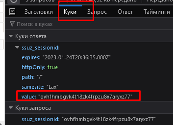
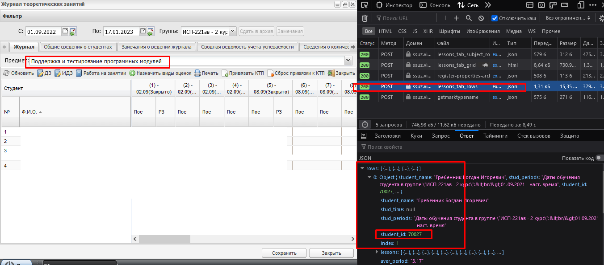
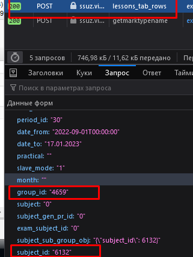
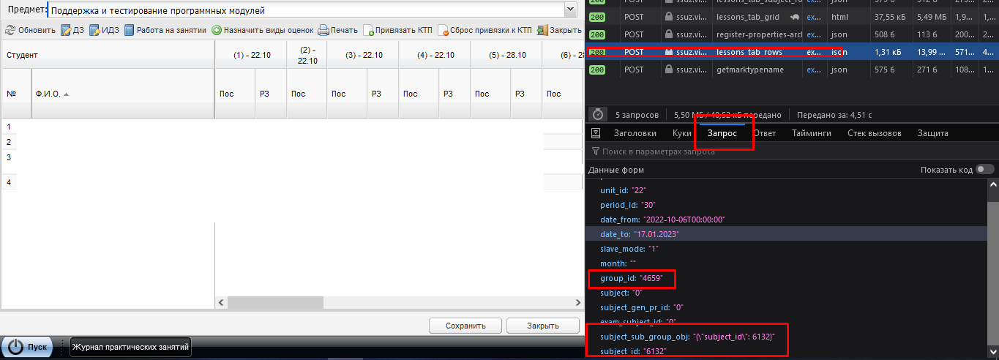
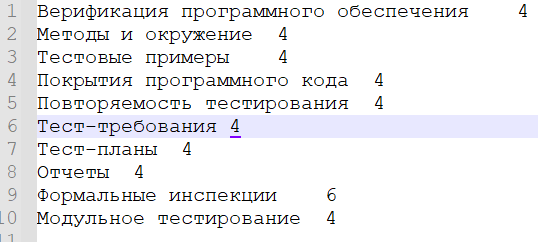
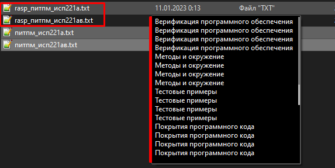

# Электронный журнал

**Эта программа умеет выставлять темы, закрывать и открывать их. Теперь умеет выставлять столбец оценок, но не сами оценки**

---

## Предустановка

1. Скачиваем и устанавливаем [Python 3.10](https://www.python.org/downloads/release/python-3109/) (лучше) или 3.9.
2. Скачать проект любым способом. Открыть скачанный проект
3. Открыть консоль в папке
4. Ввести команду `pip install -r requirements.txt` в консоль. Если нет ни каких ошибок - то всё ок
5. Переименовать файл `.env-template` в `.env`

---

## Подготовка, делаем один раз

1. Открываем файл `.env`
2. Изменяем `DATES_FROM=...` в зависимости от года, который хотите так заполнить, ИМЕННО В ТАКОМ ФОРМАТЕ. 
**Обязательно выбрать одну дату из 2. Старого года или нового**
3. Где нибудь на диске создаём папочку, в них будет храниться даты, этот путь вставляем в `DIIR=...`
4. **Следующее действие делать раз в пол года:**
   В папке которую указали создаём ещё 2 папки `тоерия` и `практика`

---

## Действия которые нужно выполнять каждый раз, когда хотите заполнить журнал
1. Открываем файл `.env`
2. Изменяем дату в `DATES=...` лучше брать дату, которая стоит на сайте в ЭЖ, в обычном формате
   _Там дата + 7 дней берётся_

---

## Инструкция по работе

### 1. Нам нужно авторизоваться.

Открываем файл `.env`. 

`COOKIE=...` - чтобы ЭЛ журнал знал что это вы, _берём в любом запросе на странице веб сайта ЭЖ > куки_

Пояснение: как только авторизовались в ЭЖ, нажимаем кнопку f12(инструменты разработчика\исследовать страницу итд). Открываем появившуюся вкладку сеть, выбираем любой запрос, там нажимаем куки, как показано на рисунке, копируем и вставляем в наш файл.



### 2. Первым делом нужно заполнить файлик `spisok_student.py`. В нём находися важная информаия для заполнения журнала.

**_Здесь есть 2 способо_**

#### **1.Первый - автоматический:**

Должен работать 😊

После предыдущего шага нажимаем пункт: `3. Создать файл spisok_students (пока теория)
`
Подумает, выдаст информацию и если вернёт в меню, значит всё прошло успешно! Можем продолжать.

А вот для заполнения практики, увы пока только ручной режим.

---

#### **2. Второй - ручной:**

- **Первое теория**. Заполнить по аналогии все группы, в том числе и платников.

```py
spisok = [
	{"group": "имя_группы_не_платники", "student_id": 70002, "group_id": 4649,"subject_id":"6132", "id":0},

	{"group": "имя_группы_платники", "student_id": 70027, "group_id": 4659,"subject_id":"6132", "id":1},
]
```

- `group` - название группы и предмета, важно как оно будет и как будут платники записаны, так как будет создат такой файл, поэтому пишем по тем правилам по которым можно создавать файлы. То есть ни каких `\*#@$%` итд.

- `student_id` - номер первого студента, вообще без разницу какого по счёту, но первый удобно. Где его взять?

  - Заходим в теорию
  - Выбираем правильную дату
  - Открываем _инструменты разработчика (f12)_
  - Нажимаем сеть
  - Всё ощичаем(корзина)
  - Выбираем группу
  - Выбираем предмет
  - В сети ищем url `https://ssuz.vip.edu35.ru/actions/register/lessons_tab/lessons_tab_rows`
  - Открываем ответ
  - Ищем `rows>0>student_id`



***Теперь мы понимаем почему у нас ЭЖ такой тупой и тормознутый, ~~его писали однорукие ...~~ он при каждом выборе, загружает студентов С личными датами, каждый раз!***

- group_id - ничего не закрываем, нажимаем **_запрос_** и ищем group_id

- subject_id - там же ищем



- id - ваш порядковый номер, по порядку

- Делаем так пока не заполним по всем своим группам

---

- **Второе практика**.

1. В этом же файле объект spisok_practicy - практика, почти всё тоже самое, только разбиваем на под группы.

```py
spisok_practicy = [
	{"group": "питпм_исп221а", "student_id": '70016', "group_id": '4649',"subject_id":'6132',"sub_group_id":'13664', "id":0},#1


	{"group": "питпм_исп221ав", "student_id": '70016', "group_id": '4649',"subject_id":'6132',"sub_group_id":'13665', "id":1},#2


	{"group": "питпм_исп221ав", "student_id": '70027', "group_id": '4659',"subject_id":'6132', "id":2},
]
```
Берём те же самые поля, но + теперь ещё нужно sub_group_id - подгруппа, у платников нет.



***Важно, в практике не перепутать сначала идёт 1 группа, потом 2 и платники. Эти две последние с одинаковыми именами!***

Поздравляю вы справились, но это только начало😁.

---

### 3. Пришло время создать файлы с теорией.
   Запускаем программу, запускаем `TemaEJ.py`. Видим меню и выбираем `1 - Создать файлики`
   Но будь мы не программисты, если бы дублировали их вручную. Выбираем то что нужно практика\лекции и вуаля они есть

### 4. Заполняем это всё дело.

Теперь заполняем в формате: тема `Tab` колл-во_часов


- Так теорию: платники и бюждетники
- Практику: 1 группа, 2 и платники

***Обращаю внимание что если наступило новое полугодие, выставленные темы убираем, а не выставленные ставим. Программа не умная и за вас считать не умеет***

_Подробно будет показано в видео (когда нибудь оно выйдет)_

Класс.Супер.Идём дальше.

---

### 5. В приложении нажимаем кнопочку `2 - Продублировать темы в файлах`

Создаётся новые файлы со всей расчасовкой.


**Те которые файлы, которые вручную заполняли можно удалить, а можно и оставить**

Раз сделали, и больше эти пункты по заполнению темами нам не понядобятся. До следующего полугодия.

### 6. Проверям работоспособность полученных данных.
   Нажимаем `5. Проверить столбцы`.

Если всё правильно вам выдаст в консоль фио студента и дни пар. Что бы продолжить нажимайте enter.

---

Теперь для вас доступен весь оставшийся функционал.

- Выставить темы, темы выставляются разом на указанную дату. Темы переписываются каждый раз в ЭЖ.

Закрыть и откыть занятие, тоже разом и до конца.

## Лицензия

Это бесплатное программное обеспечение, и его можно распространять в соответствии с условиями, указанными в файле [ЛИЦЕНЗИЯ](LICENSE.md). При копировании или модификации указывать автора.

## Вклад

Надеюсь что вы внесёте свой влкад в улучшение программы и не останетесь равнодушными или поддержите автора. Буду рад увидеть от вас pull request.

В идеале:

- Нековыряться в инструментах разработика и автоматом генерировать файлы списков групп.
- Автоматически переносить оценки из google sheets
- И прочее
- снять видео